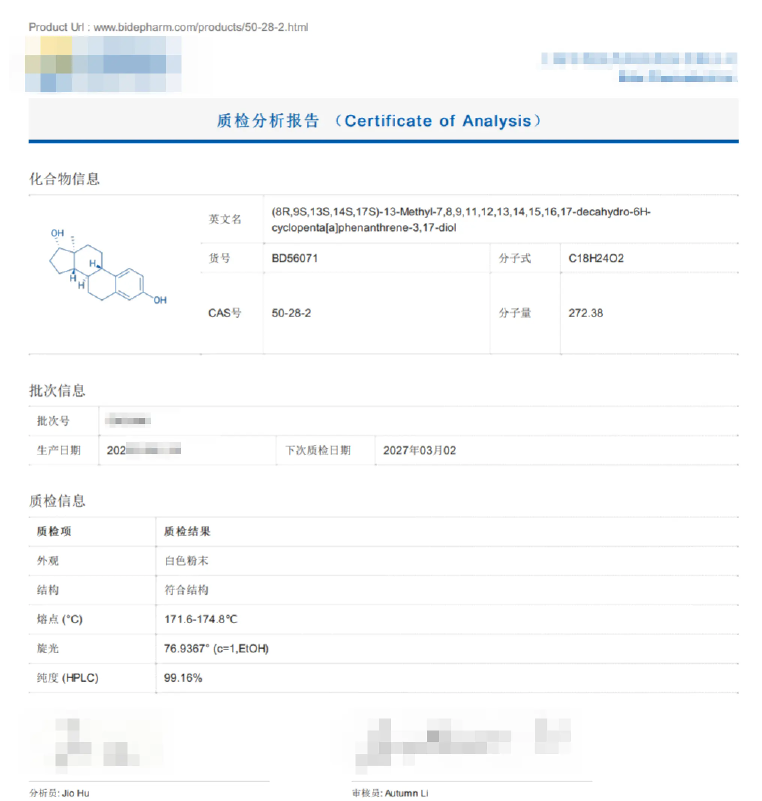

# 雌二醇凝胶自制方法

图片待补充，主要分享配方，制作方法还在优化但是已经能用且还行了。

**自制的雌二醇凝胶不得用于医疗用途、不得销售，仅供个人学习、研发使用。**

**仅作个人分享、配方为个人使用配方，不保证吸收率能比其她人分享的配方吸收率高！但是制作方法可以参考一下。**

本人并非专业人士，仅分享个人方法。关于乙醇浓度的问题，因为我只是业余人士，也不搞学术，所以并没有找到很好的答案，只能根据有限的资料来，希望有了解的朋友能分享一下相关的问题结论。

CC-BY-SA-NC 4.0

本文很大程度上学习了 https://github.com/lydlid/estrogel-diy-guide-zh_CN 的内容，参考了 https://github.com/KristallWang/Estradiol-DIY 内的分享的部分公开专利文件，参考了部分论文的结论，参考的文章我会尽可能在末尾给出，感谢各位的付出。

本文主要修改了配方、更改了原文的材料添加顺序，欢迎给出意见、指证、pr。

## 更新说明

 - 7/24日，第一次更新。优化文本顺序。由于本人的雌二醇变质（也有可能是买到假货了）测得的浓度没有参考价值，故未更新补充（浪费45块化验费）。基于所有专利给出的配方以及研究结论，综合考虑认为雌二醇浓度在0.12%会比较合适。更新了雌二醇的价格为80元5g，价格来源某医药中间体的98+%浓度的雌二醇价格。补充了雌二醇的购买建议。开始第二次制作实验，预计调整卡波姆、雌二醇质量比，实验完成后更新本文。

 - 8/11日，开始第二大的勘误和主要更新。由于个人原因暂时可能等到一两个月后才能给出笔者本人的激素六项结果。更新卡波姆浓度至0.3～0.6%，更新雌二醇浓度补充，完善关于卡波姆和三乙醇胺的质量比例关系。

 - 8/21日，修改。

## 注意

1. 卡波姆不得入眼、不得吸入，请尽可能做好安全防护（口罩、护目镜）。若吸入请立即移至通风良好的地方。
2. 卡波姆弱酸，调节pH前避免接触溶液，以免刺激粘膜、腐蚀皮肤。
3. 于非可信渠道购买的原料可能不为真，一切非医药级产品均可能含有有害成分。
4. 制成的凝胶有贮藏期，有效雌二醇含量会随着时间下降，尤其在不当、不理想的贮藏环境下。（在实验条件下，6个月后雌二醇含量下降至93%）因此，请尽可能做到“用多少做多少”，且尽量避光贮存成品。
5. 本文的制备方法使用了丙二醇和氮酮作为促渗剂，您还可使用油酸、亚油酸、月桂醇、尿素、水杨酸、薄荷醇等促渗剂。使用复合促渗剂优于单促渗剂。
6. ***制成的凝胶不一定是透明的！不一定是透明的！不一定是透明的！只要做到卡波姆完全溶解无可见白色卡波姆水球、同时浸泡时间到位即可！雌二醇可能部分未完全溶解，只要溶液整体透明即可！***（如“健民”说明书指出本品为乳白色凝胶。）

## 方法及配方介绍

该制备方法使用水、卡波姆980作为凝胶基底，丙二醇与氮酮、乙醇作为促渗剂。

您可使用其它的任意促渗剂，促渗剂占凝胶重量1%~5%为佳。介于丙二醇与氮酮价格较便宜，建议还是同时合用两者，以达到尽可能高的利用率，提高性价比。经研究，丙二醇与氮酮作混合促渗剂较其他组合有较好的效果，在雌二醇凝胶制备相关文件中作为混合促渗剂出现频率高，综合考虑性价比，故使用此配方。

对于三乙醇胺，其常用于化妆品生产等用途，作pH调节剂使用。部分文献指出其也有促渗效果。

对于本文给出的氮酮及丙二醇的组合，以2%:1.5%混合达到最佳效果。

对于卡波姆的选择，980耐离子性和耐剪切性较好，但980、940两者在本文酒精和有效成分浓度下应该均可使用，但是，980在自制和公开的工业配方中出现频率更多，且厂家提供的关于卡波姆各型号的介绍中直接指出980的适用范围包含雌二醇凝胶。在少量购买情况下，980与940的价格不会相差很多。我所购买的厂家的（国产）50g卡波姆980比同重量的940贵了4元，所以还是使用980作为凝胶材料。

**对于酒精浓度**，参考的原方法及给出的说法是使用60%的体积浓度（质量比约54%）达到最佳吸收水平，但基于本人查询到的论文、专利均使用或推荐使用更低浓度的乙醇（质量比：专利使用20-40%，论文指出30-40%），故本人使用了更低浓度的乙醇。

请一定做好防护，如不慎吸入卡波姆请一定立刻移至通风良好的地方。（我觉得至少要带个口罩，我图省事没戴吸入了一点，呼吸困难，还是很吓人的）

请自行计算您所用的容器一次按压所出的液体量进行浓度调整，一次涂抹所需雌二醇用量在1ml液体左右即可，不应小于0.12%。

雌二醇浓度建议使用体积计算，毕竟你的瓶子按出来的是固定体积的，基本是4次1ml。

## 配方

**仅作个人分享、配方为个人使用配方，不保证吸收率能比其她人分享的配方吸收率高、效果好！欢迎大家讨论、给出意见。**

- 60%或余量 水（质量比）
- 40% 乙醇（质量比）
- 0.12%及更高浓度 雌二醇（建议使用体积计算）
- 2% 氮酮
- 1.5% 丙二醇
- 适量 三乙醇胺（计算方式下方给出，以调节完成pH至目标范围为准）
- 0.4～0.6% 卡波姆（浓度越高越粘）

三乙醇胺与卡波姆的质量比约为1.35:1，请根据卡波姆用量自行调节，请注意完成制作后应该检查溶液pH值避免完成品刺激皮肤。

卡波姆本人最新一次使用的是约0.4%的浓度，感觉差不多了，太高会很黏，在涂抹后非常黏衣服，不舒服。

雌二醇论文常用1.2mg/ml，但是考虑到mtf群体一次需要量可能更多，故建议结合您的激素六项结果确定自己的所需雌二醇用量，进行浓度调整。保持在一次涂抹1ml左右即可。

**如果需要100ml凝胶，换算为体积比，使用75%乙醇，并简化后约为：**

1. 40ml 水
2. 60ml 75%乙醇
3. 剩下的按100g（严谨点90g）乘上去就行了（三乙醇胺1.13g/ml，丙二醇约1.0，水溶性氮酮密度约为0.9g/ml）。

## 材料准备及价格估算

**本人购买的费用，仅作参考，请自行寻找可信的购买渠道，本人购买渠道均为互联网，所有除雌二醇的材料都是~~用到死都用不完的那种~~**

### 原料

- 50g 卡波姆980 国产 22元
- 100ml 水溶性氮酮 8.8元
- 500ml 1,2-丙二醇 16元
- 500ml 三乙醇胺 12元
- 5g β雌二醇 80元（带运费）
- 随便一瓶纯净水，哇哈哈最好 2元
- 500ml 一瓶酒精（本文选用常用的75%） 5元

丙二醇，三乙醇胺为分析纯，不推荐购买所谓化妆品级的。

卡波姆980，凝胶基质，个人觉得没有必要买进口的，难融、不成凝胶一般是操作问题，分散后多次加入，不要购买化妆品店的，购买 ***生物公司 的这种。

水溶性氮酮，丙二醇，促渗剂，如果经济条件不好可以只够买水溶性氮酮，当然两个都不用也是可以的，推荐两个都用。您可选用其它促渗剂，个人推荐该两种作复合。

三乙醇胺，卡波姆为弱酸，调pH至中性才成我们概念中的透明“凝胶”，您也可选用其他碱。

β雌二醇，1g 40左右，5g 80元。请寻找专业或您信任的试剂卖家。***根据个人经验***，可以寻找医药中间体购买，可以提供各批次检测报告的话所购买的就不太可能出问题。

直接寻找试剂代理商，可以以更低的价格购买试剂。基本可以做到7、8折。询价提供CAS号*50-28-2*。

购买渠道请自行寻找，本人不提供本人购买的试剂厂家、渠道信息。

例，本人所购买的质检报告：

**请注意，一定是β雌二醇！**

### 工具及相关

- 毫克称 30元
- 乳液瓶 3个10元，一个可以装100ml多一点
- 烧杯 4元
- 50ml 量筒 3元
- 移液胶管
- 搅拌棒 5根3元
- **及其推荐购买** pH试纸

如果经济条件不好，可以用其余用品替代烧杯、量筒等工具，原料中的氮酮等基本已经是最低价了（所谓的化妆品级量是少得多，但是价格和这个几乎一样，质量……就我的购买经历来说不好评价，所以推荐买这种）。

pH试纸很推荐购买，原因提及过。

#### 选配

~~或者说手边刚好有的话~~，如果做的量大可能需要这些。

磁搅是最能提升制作体验的了。别的好像也没什么能提升的了。

## 制作过程

*目前的制作方法经过实验可行。保守建议还是使用原文的方法，如果是大批量制作或者按原方法未能溶卡波姆的可以尝试本文方法。*

***制成的凝胶不一定是透明的！不一定是透明的！不一定是透明的！只要做到卡波姆完全溶解无可见白色卡波姆水球、同时浸泡时间到位即可！雌二醇可能部分未完全溶解，只要溶液接近透明即可！***

还没有图，欢迎大家pr，如果方便的话我过几天会尽可能补图上传上来。

（本文制作100g凝胶，且制作过程仍在测试改进，用的配方给出的有些许差别，实际应以上方为准，仅参考做法。）

**如果您只有一个烧杯，请先进行第二步操作，然后将功效溶液转移至其它容器，待卡波姆基底溶胀完成后混合功效溶液和卡波姆溶液。**

### 1.隔天溶解卡波姆，制作凝胶基底

（原文给出方案是先制成雌二醇溶液再加卡波姆，本文采用先用水加入卡波姆后隔天溶解，个人感觉比原文方法更易溶解，理论上溶解更快。）

可以且推荐使用热水溶解，使用热水溶解请及其小心热液飞溅。放心，卡波姆稳定，在104℃下，加热2小时，不影响其增稠性。

向烧杯加入指定量的纯净水，用毫克称量取对应量的卡波姆（注意安全），建议分多次量取后多次加入使在水中溶解，避免高速搅拌形成气泡，也不要一次全加进去不搅拌，也容易形成“水球”。完成后待卡波姆溶胀24-48小时，期间可多次，搅拌均匀，搅拌至透明稍白溶液。至少需要浸泡8小时。由于卡波姆的确很难融，也容易形成白色的水圆球，可以加热搅拌（直接烧杯拿去烧，注意飞溅）。

如果使用磁搅，在加入卡波姆后低速搅拌溶液，时不时用玻璃棒沿烧杯边缘刮下粘在壁上的未完全泡开的卡波姆凝胶。加入时一定低速搅拌最好不搅拌，加入后也不宜速度过快，500rpm即可。时间越久越好，急着用也可以等到成透明稍白溶液也可。加热也可以很大程度加速溶解。

### 2.加入剩余材料

*有条件及大批量制作推荐在另外的容器制成该溶液B,与第一步溶液A凝胶基底混合。*

加入雌二醇、酒精后搅拌均匀至完全溶解。可以适当加热至40度左右加速溶解，然后使用移液胶管或其他工具加入丙二醇和水溶性氮酮。

请尽可能多的搅拌，确保完全溶解，可以静止后过一会接着继续搅拌，使用磁搅推荐至少搅拌半小时，手工可以隔一下搅拌一下。注意乙醇挥发。

### 3.转移溶液，成凝胶态

*笔者先调节了pH值，再进行转移的。可能有助于尽可能减少瓶内气泡，增加均匀度。*

转移溶液适量至乳液瓶，按比调pH，至溶液成无色透明凝胶态。建议使用pH试纸确保凝胶不会腐蚀皮肤。

转移完成后静置一段时间后即可使用。

## 参考文献

待补充。